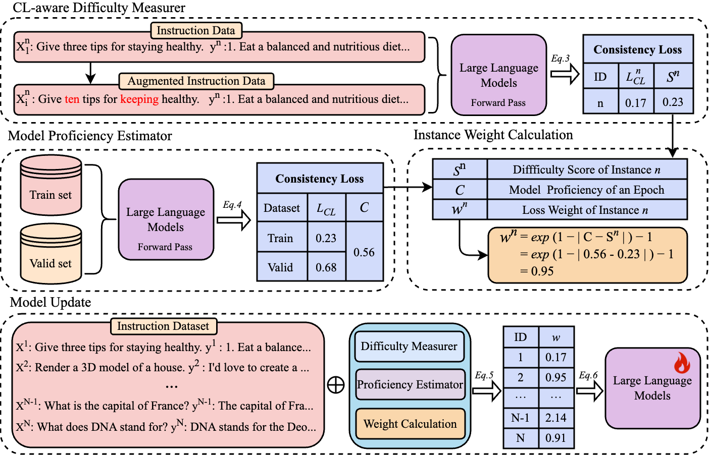

<div align="center">
    <h2>
Curriculum Consistency Learning for Conditional Sentence Generation    </h2>
</div>

## Overview


We introduce Curriculum Consistency Learning (CCL), a novel strategy that guides models to learn consistency in alignment with their current capacity to differentiate between features. 
CCL is designed around the inherent aspects of CL-related losses, promoting task independence and simplifying implementation.
Implemented across four representative CSG tasks, including instruction tuning (IT) for large language models and machine translation (MT) in three modalities (text, speech, and vision), CCL demonstrates marked improvements. 
Specifically, it delivers +2.0 average accuracy point improvement compared with vanilla IT and an average increase of +0.7 in COMET scores over traditional CL methods in MT tasks.
Our comprehensive analysis further indicates that models utilizing CCL are particularly adept at managing complex instances, showcasing the effectiveness and efficiency of CCL in improving CSG models.

<div align="center">
    
    <p class="image-caption">In the CL-aware Difficulty Measurer, CCL utilizes the intrinsic consistency loss to evaluate the sample difficulty. In the Model Proficiency Estimator, the training and validation sets are used to jointly determine model proficiency. Based on the sample difficulty and model proficiency, CCL can calculate the sample weight for the model training.</p>
</div>

### Environment

Framework Versions:

- PyTorch >= 2.0.1
- Python  >= 3.10.0
- Transformers == 4.35.0
```
git clone git@github.com:xinxinxing/Curriculum-Consistency-Learning.git

pip3 install -r requirements.txt
```


## Train
We provide two training configuration for different LLMs, which can effectively verify the robustness of CCL.
### LLaMA-2-7B
We can utilize the following training configuration  to fine tune the LLaMA-2 LLMs.
Example usages on 4 A800 by 1 node:
```
export NCCL_SOCKET_IFNAME=eno1
export MASTER_PORT=9909
start_time="$(date "+%Y-%m-%d-%H-%M-%S")"

deepspeed --master_addr "localhost" --master_port $MASTER_PORT \
    ./train/train.py \
    --deepspeed ./train/deepspeed_zero2.conf \
    --model_name_or_path "./models--meta-llama--Llama-2-7b-hf" \
    --model_max_length 4096 \
    --data_path ./data/Alpaca.json \
    --output_dir ./output_ckpt/llama2_7b_CCL_Alpaca \
    --bf16 True \
    --num_train_epochs 5 \
    --per_device_train_batch_size 32 \
    --per_device_eval_batch_size 4 \
    --gradient_accumulation_steps 1 \
    --save_strategy "steps" \
    --save_steps 500 \
    --evaluation_strategy "no" \
    --save_total_limit 999 \
    --learning_rate 2e-5 \
    --weight_decay 0. \
    --warmup_ratio 0.03 \
    --lr_scheduler_type "cosine" \
    --logging_steps 1 \
    --tf32 True \
    --gradient_checkpointing True
    
```


### Mistral-7B

We can utilize the following configuration parameters to fine tune the Mistral LLMs.
Example usages on 4 A800 by 1 node:
```
export NCCL_SOCKET_IFNAME=eno1
export MASTER_PORT=9909
start_time="$(date "+%Y-%m-%d-%H-%M-%S")"

deepspeed --master_addr "localhost" --master_port $MASTER_PORT \
    ./train/train.py \
    --deepspeed ./train/deepspeed_zero2.conf \
    --model_name_or_path "./models--Mistral-7B-hf" \
    --model_max_length 4096 \
    --data_path ./data/Selective_Alpaca.json \
    --output_dir ./output_ckpt/mistral_7b_Selective_Alpaca \
    --bf16 True \
    --num_train_epochs 1 \
    --per_device_train_batch_size 32 \
    --per_device_eval_batch_size 4 \
    --gradient_accumulation_steps 1 \
    --save_strategy "steps" \
    --save_steps 500 \
    --evaluation_strategy "no" \
    --save_total_limit 999 \
    --learning_rate 2e-5 \
    --weight_decay 0. \
    --warmup_ratio 0.03 \
    --lr_scheduler_type "cosine" \
    --logging_steps 1 \
    --tf32 True \
    --gradient_checkpointing True
    
```


## Evaluation
We provide the scripts for running the evaluation of large language models on the open-instruction which has a list of standard benchmarks targeting the core capabilities. 
These benchmarks include:
- MMLU
```
# Evaluating llama 7B model using 5 shot directly
python -m eval.mmlu.run_eval \
    --ntrain 5 \
    --data_dir data/eval/mmlu \
    --save_dir results/mmlu/llama-7B-5shot \
    --model_name_or_path ../hf_llama_models/7B \
    --tokenizer_name_or_path ../hf_llama_models/7B \
    --eval_batch_size 4 \
```

- GSM
```
# Evaluating llama 7B model using chain-of-thought
python -m eval.gsm.run_eval \
    --data_dir data/eval/gsm/ \
    --max_num_examples 200 \
    --save_dir results/gsm/llama-7B-cot-8shot \
    --model ../hf_llama_models/7B \
    --tokenizer ../hf_llama_models/7B \
    --n_shot 8 \
```

- BBH
```
# Evaluating llama 7B model using chain-of-thought
python -m eval.bbh.run_eval \
    --data_dir data/eval/bbh \
    --save_dir results/bbh/llama-7B-cot/ \
    --model ../hf_llama_models/7B \
    --tokenizer ../hf_llama_models/7B \
    --max_num_examples_per_task 40 \
```

- TydiQA
```
# Evaluating llama 7B model, with gold passage provided
python -m eval.tydiqa.run_eval \
    --data_dir data/eval/tydiqa/ \
    --n_shot 1 \
    --max_num_examples_per_lang 100 \
    --max_context_length 512 \
    --save_dir results/tydiqa/llama-7B-goldp \
    --model ../hf_llama_model/7B \
    --tokenizer ../hf_llama_model/7B \
    --eval_batch_size 20 \
```

- AlpacaEval
```
# Use V1 of alpaca farm evaluation.
export IS_ALPACA_EVAL_2=False

python -m eval.alpaca_farm.run_eval \
    --model_name_or_path ../checkpoints \
    --save_dir results/alpaca_farm/checkpoints/ \
    --eval_batch_size 20 \
    --use_chat_format \
    --chat_formatting_function eval.templates.create_prompt_with_tulu_chat_format
```


## Citation

If you find our work is useful to you, please cite our work:

```bibtex
@article{liu2024ccl,
   title={Curriculum Consistency Learning for Conditional Sentence Generation}, 
   author={Liangxin Liu and Xuebo Liu and Lian Lian and Shengjun Cheng and Jun Rao and Tengfei Yu and Hexuan Deng and Min Zhang},
   year={2024},
   booktitle={EMNLP},
}
```

### Acknowledgement
This project cannot be developed without the following resources:
- Meta AI `LLaMA-2`: https://github.com/facebookresearch/llama
- `LLaMA-2` on HuggingFace: https://huggingface.co/meta-llama
- `Alpaca-GPT4` on HuggingFace: https://huggingface.co/datasets/vicgalle/alpaca-gpt4
- `Open-Instruct`: https://github.com/allenai/open-instruct
- `LLMZoo`: https://github.com/FreedomIntelligence/LLMZoo/tree/main
